# Orders Data Pipeline

Repositori ini berisi pipeline data end-to-end untuk mengambil data order dari API, memprosesnya dengan Spark, menyimpan hasilnya ke ClickHouse, lalu membuat dashboard analitik di Metabase.

Repository GitHub: [https://github.com/wildankev/MCI2026_Task2_Kelompok5](https://github.com/wildankev/MCI2026_Task2_Kelompok5)

Sumber data: [http://96.9.212.102:8000/orders](http://96.9.212.102:8000/orders)

Data dari API berbentuk JSON bertingkat. Setiap order memiliki daftar produk di dalam field `products`. Pipeline ini mengubah data tersebut menjadi bentuk tabular, yaitu satu baris untuk satu produk dalam satu order. Bentuk ini lebih mudah dianalisis untuk kebutuhan visualisasi produk, user, reorder, department, aisle, dan ukuran cart.

## Ringkasan Alur Pipeline

```text
Orders API
  -> Airflow DAG
  -> Python ingestion
  -> Data lake raw
  -> Spark cleaning
  -> Data lake processed
  -> ClickHouse analytics.orders_raw
  -> Metabase dashboard
```

Penjelasan singkat:

- `fetch_orders`: mengambil data dari API, melakukan flatten dari `orders -> products`, lalu menyimpan hasil awal ke data lake raw.
- `process_orders`: membaca data raw dengan Spark, membersihkan data, membuang duplikat, lalu menyimpan hasil bersih ke data lake processed.
- `load_to_clickhouse`: membaca data processed, membuat database/tabel jika belum ada, lalu memasukkan data ke ClickHouse.

## Teknologi yang Digunakan

| Komponen | Teknologi |
| --- | --- |
| Orkestrasi workflow | Apache Airflow |
| Processing data | Apache Spark / PySpark |
| Data warehouse | ClickHouse |
| Dashboard | Metabase |
| Container | Docker dan Docker Compose |
| Bahasa pemrograman | Python |

## Struktur Repository

```text
MCI2026_Task2_Kelompok5/
|-- dags/
|   |-- orders_pipeline.py
|   `-- scripts/
|       |-- fetch_orders_stream.py
|       `-- process_orders_spark.py
|-- assets/
|   `-- .gitkeep
|-- sql/
|   |-- ddl_clickhouse.sql
|   `-- queries_metabase.sql
|-- .gitignore
|-- docker-compose.yml
|-- Dockerfile
|-- README.md
`-- requirements.txt
```

Keterangan folder dan file penting:

- `dags/orders_pipeline.py`: definisi DAG Airflow dengan urutan task pipeline.
- `dags/scripts/fetch_orders_stream.py`: script untuk mengambil data dari API dan melakukan flatten.
- `dags/scripts/process_orders_spark.py`: script Spark untuk cleaning dan load ke ClickHouse.
- `sql/ddl_clickhouse.sql`: referensi DDL ClickHouse. File ini tidak wajib dijalankan manual karena tabel juga dibuat otomatis oleh pipeline.
- `sql/queries_metabase.sql`: kumpulan query untuk membuat visualisasi di Metabase.
- `assets/`: folder untuk menyimpan gambar pendukung README, seperti bukti Airflow, ClickHouse, visualisasi query, dan dashboard final.

## Cara Menjalankan Project

### 1. Clone Repository

```bash
git clone https://github.com/wildankev/MCI2026_Task2_Kelompok5.git
cd MCI2026_Task2_Kelompok5
```

### 2. Build Image Docker

Pastikan Docker Desktop sudah berjalan, lalu jalankan:

```bash
docker-compose build
```

Perintah ini membuat image Airflow sesuai `Dockerfile` dan menginstal package dari `requirements.txt`.

### 3. Inisialisasi Airflow

```bash
docker-compose up airflow-init
```

Tahap ini menyiapkan database metadata Airflow dan membuat user admin.

Login Airflow:

```text
username: admin
password: admin
```

### 4. Jalankan Semua Service
```bash
docker-compose up -d
```

Service yang akan berjalan:

| Service | URL / Port |
| --- | --- |
| Airflow | [http://localhost:8080](http://localhost:8080) |
| Metabase | [http://localhost:3000](http://localhost:3000) |
| ClickHouse HTTP | [http://localhost:8123](http://localhost:8123) |
| ClickHouse TCP | localhost:9000 |

### 5. Trigger Pipeline di Airflow

1. Buka [http://localhost:8080](http://localhost:8080).
2. Login dengan user `admin` dan password `admin`.
3. Cari DAG bernama `orders_pipeline`.
4. Aktifkan DAG.
5. Klik tombol trigger untuk menjalankan pipeline.

Urutan task yang diharapkan:

```text
fetch_orders -> process_orders -> load_to_clickhouse
```

Jika semua task berhasil, status task di Airflow akan berwarna hijau.

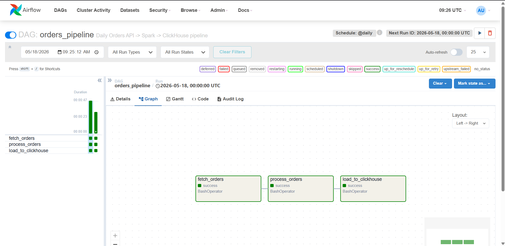

## Validasi Data di ClickHouse

Masuk ke ClickHouse client:

```bash
docker-compose exec clickhouse-server clickhouse-client \
  --user admin \
  --password rahasia
```

Cek database dan tabel:

```sql
SHOW DATABASES;
SHOW TABLES FROM analytics;
DESCRIBE analytics.orders_raw;
```

Cek jumlah data:

```sql
SELECT count()
FROM analytics.orders_raw;
```

Cek contoh isi data:

```sql
SELECT
    order_id,
    user_id,
    product_id,
    product_name,
    department,
    reordered,
    ingested_at
FROM analytics.orders_raw
ORDER BY ingested_at DESC
LIMIT 10;
```

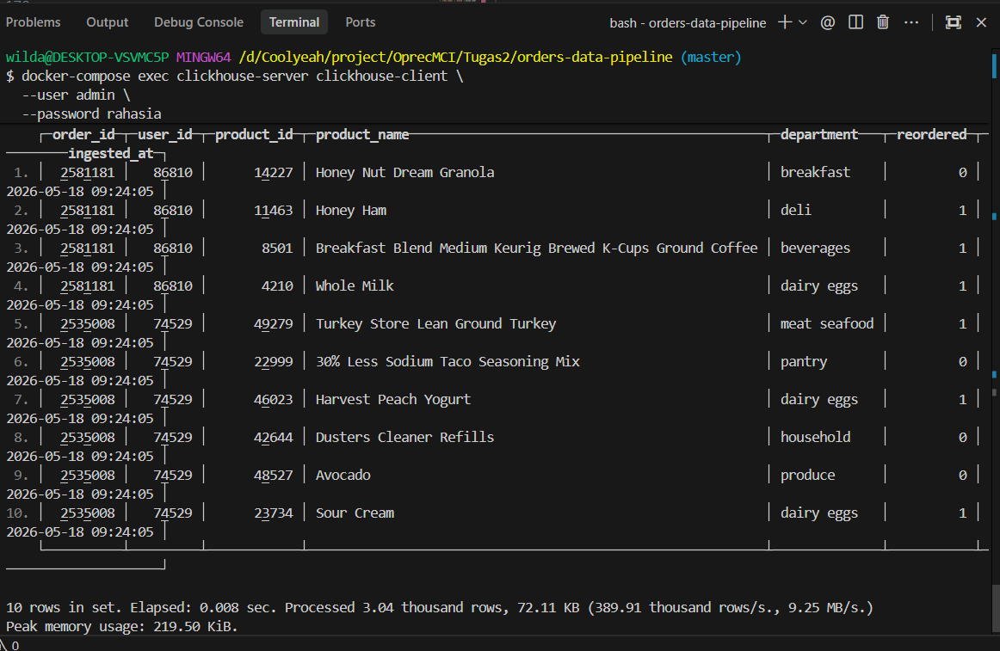

## Data Lake: Raw dan Processed

Pipeline ini memakai dua area staging di data lake:

```text
data_lake/orders/raw
data_lake/orders/processed
```

`raw` berisi data hasil pengambilan dari API setelah struktur JSON di-flatten. Data ini belum dibersihkan oleh Spark.

`processed` berisi data yang sudah dibaca dan diproses Spark. Pada tahap ini pipeline melakukan casting tipe data, membuang data dengan key penting yang null, menghapus duplikat, dan menambahkan timestamp ingestion.

Dua tahap ini dibuat agar pipeline lebih mudah dicek. Jika proses load ke ClickHouse gagal, data yang sudah bersih masih bisa diperiksa di folder `processed` tanpa harus mengambil ulang dari API.

## Schema ClickHouse

Database yang digunakan:

```sql
CREATE DATABASE IF NOT EXISTS analytics;
```

Tabel utama:

```text
analytics.orders_raw
```

View untuk konsumsi BI:

```text
analytics.orders
```

Kolom pada `analytics.orders_raw`:

| Kolom | Tipe | Keterangan |
| --- | --- | --- |
| `order_id` | `UInt32` | ID order |
| `user_id` | `UInt32` | ID user |
| `order_number` | `UInt16` | Urutan order milik user |
| `order_dow` | `UInt8` | Hari order, 0 sampai 6 |
| `order_hour_of_day` | `UInt8` | Jam order, 0 sampai 23 |
| `days_since_prior_order` | `Nullable(UInt16)` | Jarak hari dari order sebelumnya |
| `eval_set` | `String` | Label data order |
| `product_id` | `UInt32` | ID produk |
| `product_name` | `String` | Nama produk |
| `aisle_id` | `UInt16` | ID aisle |
| `aisle` | `String` | Nama aisle |
| `department_id` | `UInt16` | ID department |
| `department` | `String` | Nama department |
| `add_to_cart_order` | `UInt16` | Urutan produk dimasukkan ke cart |
| `reordered` | `UInt8` | Status reorder, 0 atau 1 |
| `ingested_at` | `DateTime` | Waktu data dimuat |

## Setup Metabase

1. Buka `http://localhost:3000`.
2. Lakukan setup awal akun Metabase.
3. Tambahkan koneksi database ClickHouse.

Konfigurasi koneksi:

| Field | Value |
| --- | --- |
| Database type | ClickHouse |
| Display name | Data Warehouse Orders |
| Host | `clickhouse-server` |
| Port | `8123` |
| Username | `admin` |
| Password | `rahasia` |

Setelah koneksi berhasil:

1. Klik `+ New`.
2. Pilih `Question`.
3. Pilih database `Data Warehouse Orders`.
4. Klik `Visualize`.
5. Pilih tipe visualisasi.

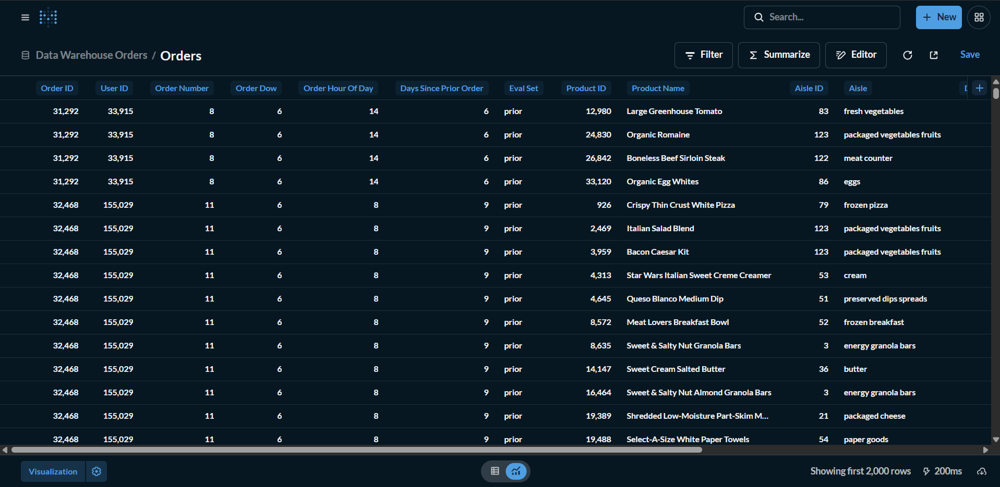

## Katalog Query dan Insight Metabase

Bagian ini menjelaskan semua query yang digunakan untuk dashboard. Setiap query berisi nama visualisasi, tujuan analisis, SQL yang dijalankan, dan placeholder gambar.

Untuk menjalankannya:
1. Klik `+ New`.
2. Pilih `SQL Query`.
3. Pilih database `Data Warehouse Orders`.
4. Copy query dari bagian katalog di bawah atau dari file `sql/queries_metabase.sql`.
5. Klik `Visualize`.
6. Pilih tipe visualisasi sesuai rekomendasi.
7. Simpan setiap chart ke dashboard utama.
### Q01 - Total Unique Orders

Tipe visualisasi: `Number`

Tujuan dan insight:

Query ini menghitung jumlah order unik yang berhasil masuk ke warehouse. Angka ini menjadi KPI utama untuk memastikan volume order yang dianalisis tidak dihitung berulang akibat struktur data per produk. Jika jumlah ini bertambah setelah pipeline dijalankan ulang, berarti data order baru berhasil masuk ke ClickHouse.

SQL:

```sql
SELECT
    uniqExact(order_id) AS total_unique_orders
FROM analytics.orders_raw;
```

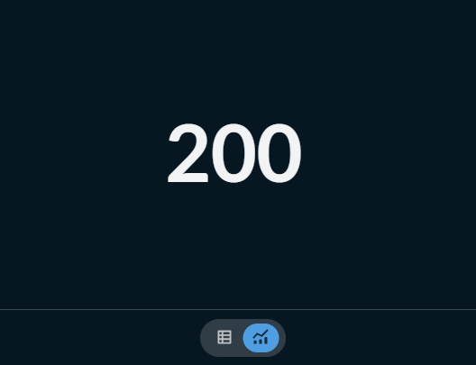

### Q02 - Total Unique Users

Tipe visualisasi: `Number`

Tujuan dan insight:

Query ini menghitung jumlah user unik yang muncul dalam data order. KPI ini menunjukkan seberapa besar cakupan customer pada data yang dianalisis. Nilainya bisa dibandingkan dengan total order untuk melihat apakah transaksi berasal dari banyak user atau hanya dari sedikit user yang aktif.

SQL:

```sql
SELECT
    uniqExact(user_id) AS total_unique_users
FROM analytics.orders_raw;
```


### Q03 - Total Products Sold

Tipe visualisasi: `Number`

Tujuan dan insight:

Karena satu baris mewakili satu produk dalam satu order, `count()` pada tabel ini merepresentasikan total item yang terjual. KPI ini berguna untuk membaca volume transaksi dari sisi produk, bukan hanya dari sisi jumlah order.

SQL:

```sql
SELECT
    count() AS total_products_sold
FROM analytics.orders_raw;
```

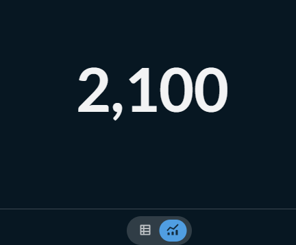

### Q04 - Overall Reorder Rate

Tipe visualisasi: `Gauge`

Tujuan dan insight:

Query ini menghitung persentase item yang merupakan pembelian ulang. Nilai reorder rate membantu melihat seberapa kuat pola repeat purchase pada data. Semakin tinggi nilainya, semakin banyak item yang sudah pernah dibeli user sebelumnya.

SQL:

```sql
SELECT
    round(sum(reordered) / count() * 100, 2) AS reorder_rate_pct
FROM analytics.orders_raw;
```

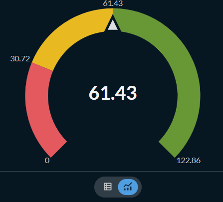

### Q05 - Average Products per Order

Tipe visualisasi: `Progress`

Tujuan dan insight:

Query ini mengukur rata-rata jumlah produk dalam satu order. Metrik ini menggambarkan ukuran keranjang belanja. Jika nilainya tinggi, berarti customer cenderung membeli banyak item dalam satu transaksi.

SQL:

```sql
SELECT
    round(count() / uniqExact(order_id), 2) AS avg_products_per_order
FROM analytics.orders_raw;
```

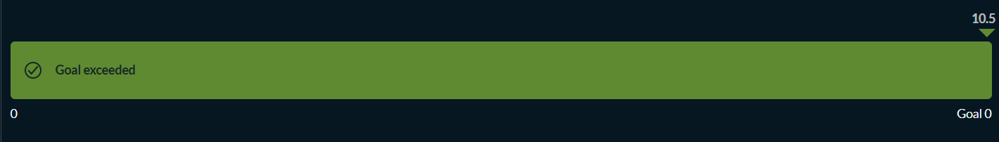

### Q06 - Top 10 Most Ordered Products

Tipe visualisasi: `Bar`

Tujuan dan insight:

Query ini menampilkan sepuluh produk dengan frekuensi pembelian tertinggi. Visualisasi ini membantu menemukan produk paling populer dan produk yang berkontribusi besar terhadap volume transaksi.

SQL:

```sql
SELECT
    product_name,
    count() AS total_items_sold
FROM analytics.orders_raw
GROUP BY
    product_id,
    product_name
ORDER BY total_items_sold DESC
LIMIT 10;
```

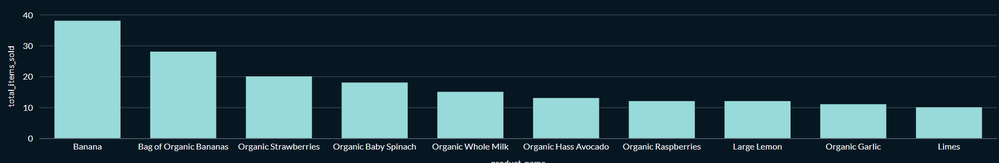

### Q07 - Top 10 Products by Reorder Rate

Tipe visualisasi: `Row`

Tujuan dan insight:

Query ini menampilkan produk dengan reorder rate tertinggi, tetapi hanya untuk produk yang muncul minimal lima kali. Filter tersebut digunakan agar produk yang hanya muncul sekali tidak langsung terlihat sempurna karena reorder rate 100 persen. Insight utamanya adalah menemukan produk yang bukan hanya sering dibeli, tetapi juga cenderung dibeli ulang.

SQL:

```sql
SELECT
    product_name,
    count() AS total_items_sold,
    round(sum(reordered) / count() * 100, 2) AS reorder_rate_pct
FROM analytics.orders_raw
GROUP BY
    product_id,
    product_name
HAVING total_items_sold >= 5
ORDER BY reorder_rate_pct DESC, total_items_sold DESC
LIMIT 10;
```

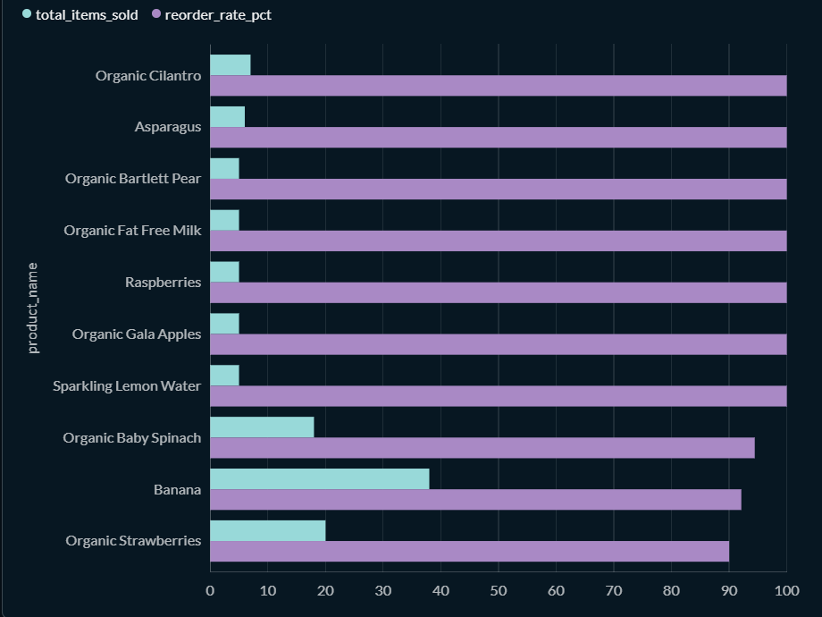

### Q08 - Top 10 Departments by Total Items Sold

Tipe visualisasi: `Bar`

Tujuan dan insight:

Query ini melihat department mana yang menyumbang item terjual paling banyak. Hasilnya berguna untuk memahami kategori besar yang paling dominan dalam basket customer.

SQL:

```sql
SELECT
    department,
    count() AS total_items_sold
FROM analytics.orders_raw
GROUP BY department
ORDER BY total_items_sold DESC
LIMIT 10;
```

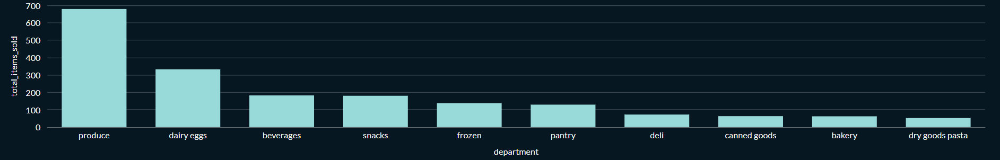

### Q09 - Top 10 Aisles by Total Items Sold

Tipe visualisasi: `Row`

Tujuan dan insight:

Query ini menampilkan aisle dengan volume item terbesar. Dibanding department, aisle memberi detail kategori yang lebih spesifik, sehingga lebih mudah melihat area produk mana yang paling sering muncul dalam order.

SQL:

```sql
SELECT
    aisle,
    count() AS total_items_sold
FROM analytics.orders_raw
GROUP BY aisle
ORDER BY total_items_sold DESC
LIMIT 10;
```
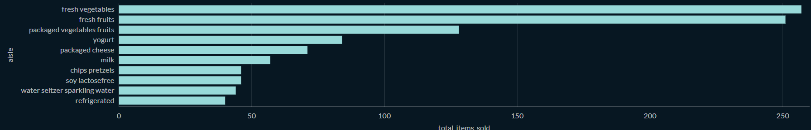

### Q10 - Department Share of Item Sales

Tipe visualisasi: `Pie`

Tujuan dan insight:

Query ini menunjukkan proporsi kontribusi setiap department terhadap total item sold. Pie chart cocok untuk melihat komposisi kategori secara cepat, terutama department mana yang paling besar porsinya dibanding kategori lain.

SQL:

```sql
SELECT
    department,
    count() AS total_items_sold
FROM analytics.orders_raw
GROUP BY department
ORDER BY total_items_sold DESC;
```
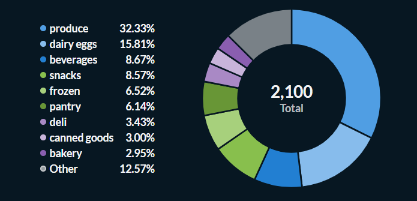

### Q11 - Order Count by Hour of Day

Tipe visualisasi: `Line`

Tujuan dan insight:

Query ini menghitung jumlah order berdasarkan jam dalam sehari. Visualisasi line membantu melihat jam dengan aktivitas order paling tinggi. Insight ini dapat digunakan untuk memahami pola waktu belanja customer.

SQL:

```sql
SELECT
    order_hour_of_day AS hour_of_day,
    uniqExact(order_id) AS total_orders
FROM analytics.orders_raw
GROUP BY order_hour_of_day
ORDER BY order_hour_of_day;
```
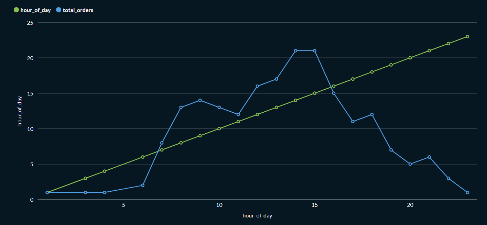

### Q12 - Order Count by Day of Week

Tipe visualisasi: `Bar`

Tujuan dan insight:

Query ini menampilkan jumlah order untuk setiap hari dalam seminggu. Field `order_dow` dipetakan menjadi label hari agar lebih mudah dibaca. Chart ini menunjukkan hari mana yang memiliki volume order paling tinggi.

SQL:

```sql
SELECT
    order_dow,
    arrayElement(
        ['Sun', 'Mon', 'Tue', 'Wed', 'Thu', 'Fri', 'Sat'],
        order_dow + 1
    ) AS day_name,
    uniqExact(order_id) AS total_orders
FROM analytics.orders_raw
GROUP BY order_dow
ORDER BY order_dow;
```

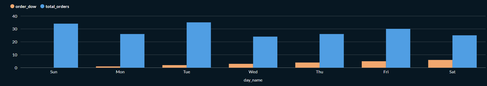

### Q13 - Order Size Distribution

Tipe visualisasi: `Area`

Tujuan dan insight:

Query ini mengelompokkan ukuran order berdasarkan jumlah produk dalam cart. Bucket seperti `1-5`, `6-10`, dan seterusnya membantu melihat apakah sebagian besar customer melakukan pembelian kecil atau besar.

SQL:

```sql
WITH order_sizes AS (
    SELECT
        order_id,
        count() AS product_count
    FROM analytics.orders_raw
    GROUP BY order_id
),
bucketed AS (
    SELECT
        intDiv(product_count - 1, 5) * 5 + 1 AS bucket_start
    FROM order_sizes
)
SELECT
    concat(
        toString(bucket_start),
        '-',
        toString(bucket_start + 4)
    ) AS cart_size_bucket,
    count() AS total_orders
FROM bucketed
GROUP BY bucket_start
ORDER BY bucket_start;
```

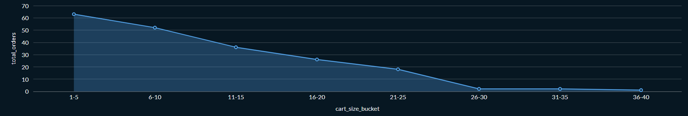

### Q14 - Product Volume Versus Reorder Rate

Tipe visualisasi: `Scatter`

Tujuan dan insight:

Query ini membandingkan total order produk dengan reorder rate. Scatter plot membantu membedakan produk yang populer karena volumenya tinggi dan produk yang kuat karena sering dibeli ulang. Produk ideal biasanya berada pada area volume tinggi dan reorder rate tinggi.

SQL:

```sql
SELECT
    product_name,
    uniqExact(order_id) AS total_orders,
    round(sum(reordered) / count() * 100, 2) AS reorder_rate_pct,
    count() AS total_items_sold
FROM analytics.orders_raw
GROUP BY
    product_id,
    product_name
HAVING total_items_sold >= 3
ORDER BY total_orders DESC;
```

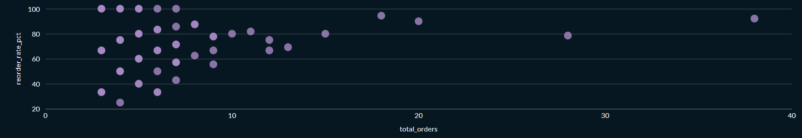

### Q15 - User Order Frequency Versus Average Basket Size

Tipe visualisasi: `Scatter`

Tujuan dan insight:

Query ini membandingkan frekuensi order user dengan rata-rata ukuran cart. Chart ini membantu melihat user yang sering order dan sekaligus memiliki basket besar. User seperti ini dapat dianggap sebagai customer bernilai tinggi.

SQL:

```sql
WITH user_order_sizes AS (
    SELECT
        user_id,
        order_id,
        count() AS products_in_order
    FROM analytics.orders_raw
    GROUP BY
        user_id,
        order_id
)
SELECT
    user_id,
    count() AS order_frequency,
    round(avg(products_in_order), 2) AS avg_order_size
FROM user_order_sizes
GROUP BY user_id
ORDER BY order_frequency DESC, avg_order_size DESC;
```
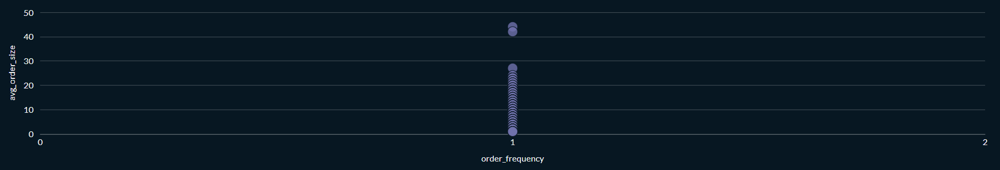

### Q16 - Reorder Rate Across Order Number

Tipe visualisasi: `Line`

Tujuan dan insight:

Query ini menunjukkan perubahan reorder rate berdasarkan urutan order customer. Visualisasi yang paling cocok adalah line chart, karena `order_number` adalah urutan transaksi, bukan kolom tanggal. Jika reorder rate naik pada order ke sekian, berarti semakin lama customer bertransaksi, semakin besar kemungkinan mereka membeli produk yang pernah dibeli sebelumnya.

SQL:

```sql
SELECT
    order_number,
    round(sum(reordered) / count() * 100, 2) AS reorder_rate_pct
FROM analytics.orders_raw
GROUP BY order_number
ORDER BY order_number;
```
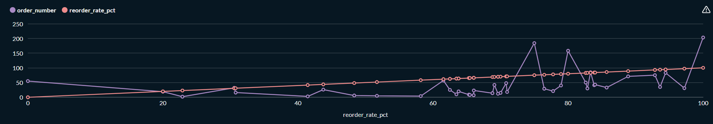

### Q17 - Order Volume by Days Since Prior Order

Tipe visualisasi: `Line`

Tujuan dan insight:

Query ini melihat distribusi jarak hari sejak order sebelumnya. Insight ini menunjukkan interval waktu yang paling sering muncul sebelum customer melakukan order lagi.

SQL:

```sql
SELECT
    days_since_prior_order,
    uniqExact(order_id) AS total_orders
FROM analytics.orders_raw
WHERE days_since_prior_order IS NOT NULL
GROUP BY days_since_prior_order
ORDER BY days_since_prior_order;
```
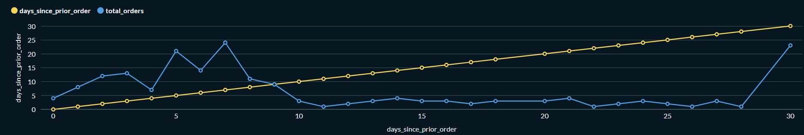

### Q18 - Order Count and Average Cart Size by Day of Week

Tipe visualisasi: `Combo`

Tujuan dan insight:

Query ini menggabungkan dua metrik dalam satu visualisasi: jumlah order dan rata-rata ukuran cart per hari. Dengan combo chart, kita bisa melihat apakah hari dengan order tinggi juga memiliki cart size yang besar.

SQL:

```sql
WITH order_sizes AS (
    SELECT
        order_id,
        any(order_dow) AS order_dow,
        count() AS cart_size
    FROM analytics.orders_raw
    GROUP BY order_id
)
SELECT
    order_dow,
    arrayElement(
        ['Sun', 'Mon', 'Tue', 'Wed', 'Thu', 'Fri', 'Sat'],
        order_dow + 1
    ) AS day_name,
    uniqExact(order_id) AS total_orders,
    round(avg(cart_size), 2) AS avg_cart_size
FROM order_sizes
GROUP BY order_dow
ORDER BY order_dow;
```
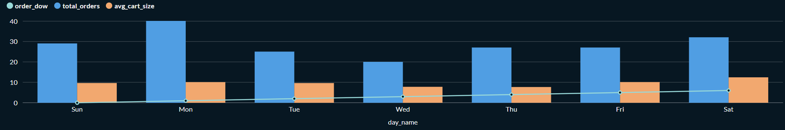

### Q19 - Department Contribution to Total Item Sales

Tipe visualisasi: `Waterfall`

Tujuan dan insight:

Query ini menampilkan kontribusi department terhadap total item sold. Waterfall dapat digunakan untuk memperlihatkan department mana yang paling besar menambah volume item pada keseluruhan transaksi.

SQL:

```sql
SELECT
    department,
    count() AS total_items_sold
FROM analytics.orders_raw
GROUP BY department
ORDER BY total_items_sold DESC
LIMIT 12;
```
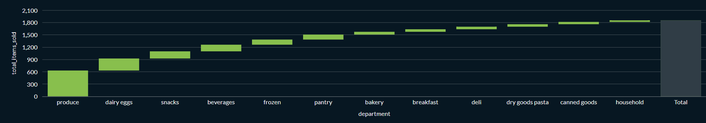

### Q20 - Reorder Rate by Department and Day of Week

Tipe visualisasi: `Table`

Tujuan dan insight:

Query ini menampilkan reorder rate setiap department untuk masing-masing hari. Sebelumnya visualisasi ini diarahkan ke `Pivot Table`, tetapi Metabase hanya mendukung pivot table untuk question yang dibuat lewat query builder, bukan native SQL. Karena itu query ini dibuat sebagai pivot manual di SQL dan divisualisasikan sebagai `Table`. Insight yang dicari adalah department mana yang memiliki pola reorder kuat pada hari tertentu.

SQL:

```sql
SELECT
    department,
    if(
        countIf(order_dow = 0) = 0,
        NULL,
        round(sumIf(reordered, order_dow = 0) / countIf(order_dow = 0) * 100, 2)
    ) AS sun_reorder_rate_pct,
    if(
        countIf(order_dow = 1) = 0,
        NULL,
        round(sumIf(reordered, order_dow = 1) / countIf(order_dow = 1) * 100, 2)
    ) AS mon_reorder_rate_pct,
    if(
        countIf(order_dow = 2) = 0,
        NULL,
        round(sumIf(reordered, order_dow = 2) / countIf(order_dow = 2) * 100, 2)
    ) AS tue_reorder_rate_pct,
    if(
        countIf(order_dow = 3) = 0,
        NULL,
        round(sumIf(reordered, order_dow = 3) / countIf(order_dow = 3) * 100, 2)
    ) AS wed_reorder_rate_pct,
    if(
        countIf(order_dow = 4) = 0,
        NULL,
        round(sumIf(reordered, order_dow = 4) / countIf(order_dow = 4) * 100, 2)
    ) AS thu_reorder_rate_pct,
    if(
        countIf(order_dow = 5) = 0,
        NULL,
        round(sumIf(reordered, order_dow = 5) / countIf(order_dow = 5) * 100, 2)
    ) AS fri_reorder_rate_pct,
    if(
        countIf(order_dow = 6) = 0,
        NULL,
        round(sumIf(reordered, order_dow = 6) / countIf(order_dow = 6) * 100, 2)
    ) AS sat_reorder_rate_pct,
    count() AS total_items_sold
FROM analytics.orders_raw
GROUP BY department
ORDER BY total_items_sold DESC;
```
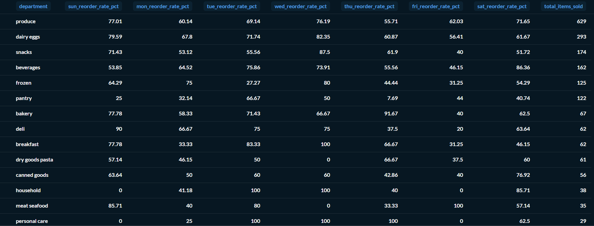

### Q21 - Product Performance Table with Rank Inside Department

Tipe visualisasi: `Table`

Tujuan dan insight:

Query ini membuat tabel performa produk lengkap dengan ranking di dalam department masing-masing. Tabel ini membantu membaca produk terbaik per department, baik dari sisi total item sold, unique order, maupun reorder rate.

SQL:

```sql
WITH product_metrics AS (
    SELECT
        department,
        product_id,
        product_name,
        count() AS total_items_sold,
        uniqExact(order_id) AS unique_orders,
        round(sum(reordered) / count() * 100, 2) AS reorder_rate_pct
    FROM analytics.orders_raw
    GROUP BY
        department,
        product_id,
        product_name
)
SELECT
    department,
    product_name,
    total_items_sold,
    unique_orders,
    reorder_rate_pct,
    rank() OVER (
        PARTITION BY department
        ORDER BY total_items_sold DESC
    ) AS rank_within_department
FROM product_metrics
ORDER BY
    department,
    rank_within_department;
```
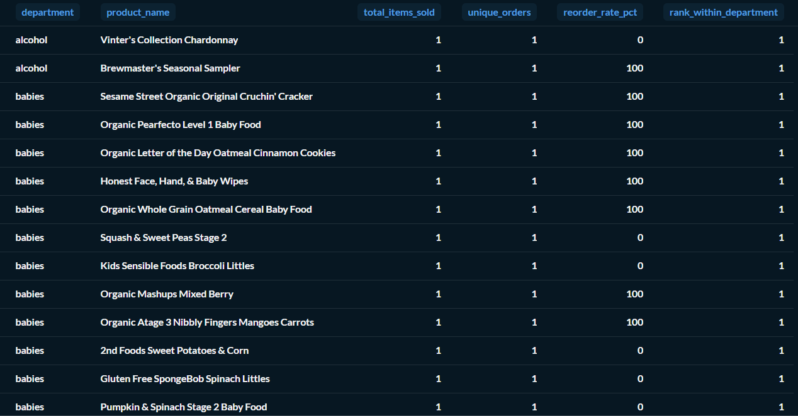

### Q22 - Top 20 Users by Order Activity

Tipe visualisasi: `Table`

Tujuan dan insight:

Query ini menampilkan user paling aktif berdasarkan jumlah order. Selain itu, query juga menampilkan total item yang dibeli dan rata-rata produk per order. Tabel ini membantu mengidentifikasi user dengan aktivitas belanja tinggi.

SQL:

```sql
SELECT
    user_id,
    uniqExact(order_id) AS total_orders,
    count() AS total_items_bought,
    round(count() / uniqExact(order_id), 2) AS avg_products_per_order
FROM analytics.orders_raw
GROUP BY user_id
ORDER BY total_orders DESC, total_items_bought DESC
LIMIT 20;
```
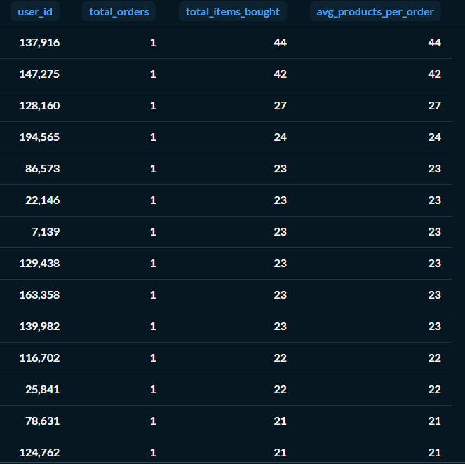

### Q23 - Cart Position Retention

Tipe visualisasi: `Funnel`

Tujuan dan insight:

Query ini melihat berapa banyak order yang mencapai posisi cart tertentu, dari item pertama sampai item kesepuluh. Funnel membantu menunjukkan penurunan jumlah order saat posisi item semakin jauh. Semakin tinggi step yang masih banyak terisi, semakin besar ukuran cart customer.

SQL:

```sql
SELECT
    concat('Item ', toString(add_to_cart_order)) AS cart_step,
    uniqExact(order_id) AS orders_reaching_step
FROM analytics.orders_raw
WHERE add_to_cart_order <= 10
GROUP BY add_to_cart_order
ORDER BY add_to_cart_order;
```
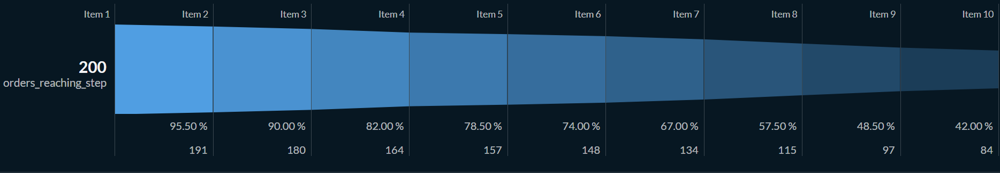

### Q24 - Department to Aisle Item Flow

Tipe visualisasi: `Sankey`

Tujuan dan insight:

Query ini menampilkan aliran item dari department menuju aisle. Sankey cocok untuk melihat bagaimana volume item dari kategori besar tersebar ke kategori yang lebih spesifik. Insight ini berguna untuk membaca struktur kontribusi department dan aisle dalam satu visual.

SQL:

```sql
SELECT
    department AS source,
    aisle AS target,
    count() AS total_items_sold
FROM analytics.orders_raw
GROUP BY
    department,
    aisle
ORDER BY total_items_sold DESC
LIMIT 30;
```

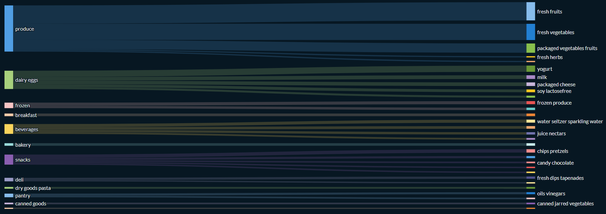

## Menghentikan Service

Untuk menghentikan container tanpa menghapus volume:

```bash
docker-compose down
```

Jika ingin menghapus volume dan mengulang setup dari awal:

```bash
docker-compose down -v
```

## Konfigurasi Environment

| Variable | Default | Keterangan |
| --- | --- | --- |
| `ORDERS_API_URL` | `http://96.9.212.102:8000/orders` | Endpoint sumber data orders |
| `ORDERS_RAW_PATH` | `/opt/airflow/data_lake/orders/raw` | Lokasi staging raw |
| `ORDERS_OUTPUT_FORMAT` | `parquet` | Format file staging |
| `ORDERS_PROCESSED_PATH` | `/opt/airflow/data_lake/orders/processed/cleaned_orders` | Lokasi staging processed |
| `CLICKHOUSE_HOST` | `clickhouse-server` | Host ClickHouse dalam Docker network |
| `CLICKHOUSE_NATIVE_PORT` | `9000` | Port native ClickHouse |
| `CLICKHOUSE_HTTP_PORT` | `8123` | Port HTTP/JDBC ClickHouse |
| `CLICKHOUSE_USER` | `admin` | User ClickHouse |
| `CLICKHOUSE_PASSWORD` | `rahasia` | Password ClickHouse |
| `CLICKHOUSE_DATABASE` | `analytics` | Database target |
| `CLICKHOUSE_TABLE` | `orders_raw` | Tabel target |
| `CLICKHOUSE_JDBC_PACKAGE` | `ru.yandex.clickhouse:clickhouse-jdbc:0.3.2` | Dependency JDBC Spark |

## Anggota Kelompok

[isi sesuai kelompok]

## Lisensi

Project ini dibuat untuk kebutuhan tugas dan pembelajaran Data Engineering pada MCI 2026.
